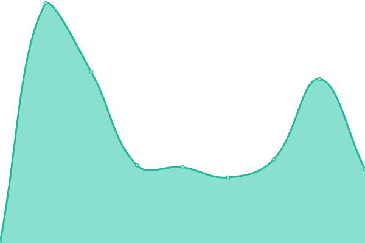
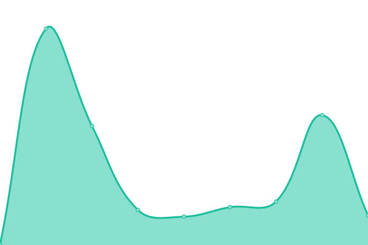
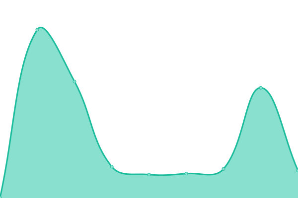
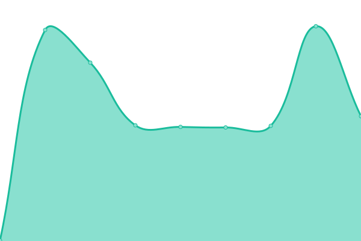
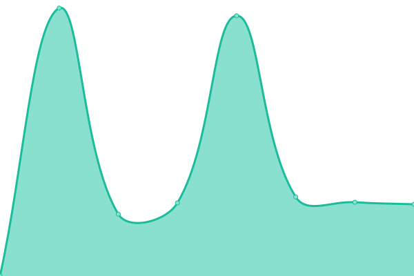
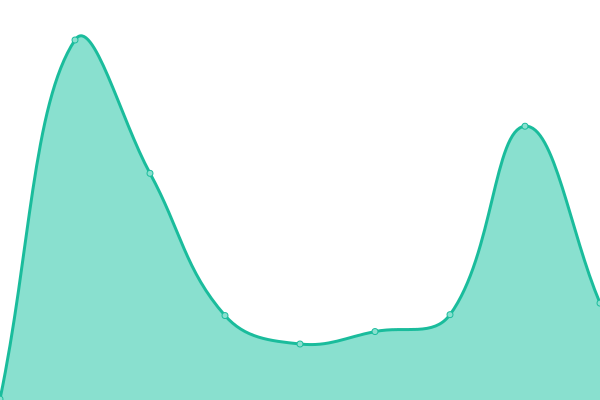

# [📈 Live Status](https://monitoring.mrbmedia.org): <!--live status--> **🟧 Partial outage**

This repository contains the open-source uptime monitor and status page for [Michael Brant](http://michaelbrant.com), powered by [Upptime](https://github.com/upptime/upptime).

With [Upptime](https://upptime.js.org), you can get your own unlimited and free uptime monitor and status page, powered entirely by a GitHub repository. We use [Issues](https://github.com/mrbrant89/mrb-monitoring/issues) as incident reports, [Actions](https://github.com/mrbrant89/mrb-monitoring/actions) as uptime monitors, and [Pages](https://monitoring.mrbmedia.org) for the status page.

<!--start: status pages-->
<!-- This summary is generated by Upptime (https://github.com/upptime/upptime) -->
<!-- Do not edit this manually, your changes will be overwritten -->
<!-- prettier-ignore -->
| URL | Status | History | Response Time | Uptime |
| --- | ------ | ------- | ------------- | ------ |
|  [Sync Social Media [syncsocialmedia.com]](https://syncsocialmedia.com) | 🟩 Up | [sync-social-media-syncsocialmedia-com.yml](https://github.com/mrbrant89/mrb-monitoring/commits/HEAD/history/sync-social-media-syncsocialmedia-com.yml) | 

 859ms
     
 | 

<a href="https://monitoring.mrbmedia.org/history/sync-social-media-syncsocialmedia-com">100.00%</a>
    

|  [The Resale Source [theresalesource.com]](https://theresalesource.com) | 🟩 Up | [the-resale-source-theresalesource-com.yml](https://github.com/mrbrant89/mrb-monitoring/commits/HEAD/history/the-resale-source-theresalesource-com.yml) | 

 683ms
     
 | 

<a href="https://monitoring.mrbmedia.org/history/the-resale-source-theresalesource-com">100.00%</a>
    

|  [La Jolla Presbyterian Church [ljpres.org]](https://ljpres.org) | 🟩 Up | [la-jolla-presbyterian-church-ljpres-org.yml](https://github.com/mrbrant89/mrb-monitoring/commits/HEAD/history/la-jolla-presbyterian-church-ljpres-org.yml) | 

 1688ms
     
 | 

<a href="https://monitoring.mrbmedia.org/history/la-jolla-presbyterian-church-ljpres-org">100.00%</a>
    

|  [Vitality Integrative Wellness [growwithvitality.com]](https://growwithvitality.com) | 🟩 Up | [vitality-integrative-wellness-growwithvitality-com.yml](https://github.com/mrbrant89/mrb-monitoring/commits/HEAD/history/vitality-integrative-wellness-growwithvitality-com.yml) | 

 318ms
     
 | 

<a href="https://monitoring.mrbmedia.org/history/vitality-integrative-wellness-growwithvitality-com">100.00%</a>
    

|  [Hannibal Square [hannibalsquareclt.org]](https://hannibalsquareclt.org) | 🟩 Up | [hannibal-square-hannibalsquareclt-org.yml](https://github.com/mrbrant89/mrb-monitoring/commits/HEAD/history/hannibal-square-hannibalsquareclt-org.yml) | 

 448ms
     
 | 

<a href="https://monitoring.mrbmedia.org/history/hannibal-square-hannibalsquareclt-org">100.00%</a>
    

|  [Vintage Camera Box [vintagecamerabox.com]](https://vintagecamerabox.com) | 🟩 Up | [vintage-camera-box-vintagecamerabox-com.yml](https://github.com/mrbrant89/mrb-monitoring/commits/HEAD/history/vintage-camera-box-vintagecamerabox-com.yml) | 

 331ms
     
 | 

<a href="https://monitoring.mrbmedia.org/history/vintage-camera-box-vintagecamerabox-com">100.00%</a>
    

|  [Joy Furhman & Associates [joyfuhrman.com]](https://joyfuhrman.com) | 🟩 Up | [joy-furhman-and-associates-joyfuhrman-com.yml](https://github.com/mrbrant89/mrb-monitoring/commits/HEAD/history/joy-furhman-and-associates-joyfuhrman-com.yml) | 

 1348ms
     
 | 

<a href="https://monitoring.mrbmedia.org/history/joy-furhman-and-associates-joyfuhrman-com">100.00%</a>
    

|  [Frontier Financial Planning [frontierfp.biz]](https://www.frontierfp.biz) | 🟩 Up | [frontier-financial-planning-frontierfp-biz.yml](https://github.com/mrbrant89/mrb-monitoring/commits/HEAD/history/frontier-financial-planning-frontierfp-biz.yml) | 

 1419ms
     
 | 

<a href="https://monitoring.mrbmedia.org/history/frontier-financial-planning-frontierfp-biz">100.00%</a>
    

|  [Witchland [witchlandplay.com]](https://witchlandplay.com) | 🟩 Up | [witchland-witchlandplay-com.yml](https://github.com/mrbrant89/mrb-monitoring/commits/HEAD/history/witchland-witchlandplay-com.yml) | 

 1100ms
     
 | 

<a href="https://monitoring.mrbmedia.org/history/witchland-witchlandplay-com">100.00%</a>
    

|  [Manage My Entity [managemyentity.com]](https://managemyentity.com) | 🟩 Up | [manage-my-entity-managemyentity-com.yml](https://github.com/mrbrant89/mrb-monitoring/commits/HEAD/history/manage-my-entity-managemyentity-com.yml) | 

 247ms
     
 | 

<a href="https://monitoring.mrbmedia.org/history/manage-my-entity-managemyentity-com">100.00%</a>
    

|  [Prosperity Road [prosperityroad.com]](https://prosperityroad.com) | 🟩 Up | [prosperity-road-prosperityroad-com.yml](https://github.com/mrbrant89/mrb-monitoring/commits/HEAD/history/prosperity-road-prosperityroad-com.yml) | 

 338ms
     
 | 

<a href="https://monitoring.mrbmedia.org/history/prosperity-road-prosperityroad-com">100.00%</a>
    

|  [A Healthy Divorce [ahealthydivorce.com]](https://ahealthydivorce.com) | 🟩 Up | [a-healthy-divorce-ahealthydivorce-com.yml](https://github.com/mrbrant89/mrb-monitoring/commits/HEAD/history/a-healthy-divorce-ahealthydivorce-com.yml) | 

 244ms
     
 | 

<a href="https://monitoring.mrbmedia.org/history/a-healthy-divorce-ahealthydivorce-com">100.00%</a>
    

|  [Bennch Transport Services [iloilocarrentals.com]](https://iloilocarrentals.com) | 🟩 Up | [bennch-transport-services-iloilocarrentals-com.yml](https://github.com/mrbrant89/mrb-monitoring/commits/HEAD/history/bennch-transport-services-iloilocarrentals-com.yml) | 

 752ms
     
 | 

<a href="https://monitoring.mrbmedia.org/history/bennch-transport-services-iloilocarrentals-com">0.00%</a>
    

|  [Ivan Cazarez [ivancazarez.com]](https://ivancazarez.com) | 🟥 Down | [ivan-cazarez-ivancazarez-com.yml](https://github.com/mrbrant89/mrb-monitoring/commits/HEAD/history/ivan-cazarez-ivancazarez-com.yml) | 

 0ms
     
 | 

<a href="https://monitoring.mrbmedia.org/history/ivan-cazarez-ivancazarez-com">0.00%</a>
    

|  [Same Day Restoration [samedaydamagerestoration.com]](https://samedaydamagerestoration.com) | 🟩 Up | [same-day-restoration-samedaydamagerestoration-com.yml](https://github.com/mrbrant89/mrb-monitoring/commits/HEAD/history/same-day-restoration-samedaydamagerestoration-com.yml) | 

 276ms
     
 | 

<a href="https://monitoring.mrbmedia.org/history/same-day-restoration-samedaydamagerestoration-com">100.00%</a>
    

|  [Tailored Legal [tailoredlegal.com]](https://tailoredlegal.com) | 🟩 Up | [tailored-legal-tailoredlegal-com.yml](https://github.com/mrbrant89/mrb-monitoring/commits/HEAD/history/tailored-legal-tailoredlegal-com.yml) | 

 1160ms
     
 | 

<a href="https://monitoring.mrbmedia.org/history/tailored-legal-tailoredlegal-com">100.00%</a>
    

|  [LMHinz Marketing [lmhinzmarketing.com]](https://lmhinzmarketing.com) | 🟩 Up | [lm-hinz-marketing-lmhinzmarketing-com.yml](https://github.com/mrbrant89/mrb-monitoring/commits/HEAD/history/lm-hinz-marketing-lmhinzmarketing-com.yml) | 

 427ms
     
 | 

<a href="https://monitoring.mrbmedia.org/history/lm-hinz-marketing-lmhinzmarketing-com">100.00%</a>
    

|  [Ben Aguilar, Esq. [benaguilarlaw.com]](https://benaguilarlaw.com) | 🟩 Up | [ben-aguilar-esq-benaguilarlaw-com.yml](https://github.com/mrbrant89/mrb-monitoring/commits/HEAD/history/ben-aguilar-esq-benaguilarlaw-com.yml) | 

 246ms
     
 | 

<a href="https://monitoring.mrbmedia.org/history/ben-aguilar-esq-benaguilarlaw-com">100.00%</a>
    

|  [Fleming & Associates [flemingandassociatesllc.com]](https://flemingandassociatesllc.com) | 🟩 Up | [fleming-and-associates-flemingandassociatesllc-com.yml](https://github.com/mrbrant89/mrb-monitoring/commits/HEAD/history/fleming-and-associates-flemingandassociatesllc-com.yml) | 

 357ms
     
 | 

<a href="https://monitoring.mrbmedia.org/history/fleming-and-associates-flemingandassociatesllc-com">100.00%</a>
    

|  [Kick the Fear out of Your Finances [l.kickthefearoutofyourfinances.com]](https://l.kickthefearoutofyourfinances.com) | 🟩 Up | [kick-the-fear-out-of-your-finances-l-kickthefearoutofyourfinances-com.yml](https://github.com/mrbrant89/mrb-monitoring/commits/HEAD/history/kick-the-fear-out-of-your-finances-l-kickthefearoutofyourfinances-com.yml) | 

 2532ms
     
 | 

<a href="https://monitoring.mrbmedia.org/history/kick-the-fear-out-of-your-finances-l-kickthefearoutofyourfinances-com">100.00%</a>
    

|  [CVSR Trivia Night [cvsrtrivianight.org]](https://cvsrtrivianight.org) | 🟩 Up | [cvsr-trivia-night-cvsrtrivianight-org.yml](https://github.com/mrbrant89/mrb-monitoring/commits/HEAD/history/cvsr-trivia-night-cvsrtrivianight-org.yml) | 

 453ms
     
 | 

<a href="https://monitoring.mrbmedia.org/history/cvsr-trivia-night-cvsrtrivianight-org">100.00%</a>
    

|  [Windermere Homes & Estates [whesd.com]](https://whesd.com) | 🟥 Down | [windermere-homes-and-estates-whesd-com.yml](https://github.com/mrbrant89/mrb-monitoring/commits/HEAD/history/windermere-homes-and-estates-whesd-com.yml) | 

 0ms
     
 | 

<a href="https://monitoring.mrbmedia.org/history/windermere-homes-and-estates-whesd-com">0.00%</a>
    

|  [SD County Escrow [sdcountyescrow.com]](https://sdcountyescrow.com) | 🟩 Up | [sd-county-escrow-sdcountyescrow-com.yml](https://github.com/mrbrant89/mrb-monitoring/commits/HEAD/history/sd-county-escrow-sdcountyescrow-com.yml) | 

 314ms
     
 | 

<a href="https://monitoring.mrbmedia.org/history/sd-county-escrow-sdcountyescrow-com">100.00%</a>
    

|  [Custom Clothing Co [customclothingco.com]](https://customclothingco.com) | 🟩 Up | [custom-clothing-co-customclothingco-com.yml](https://github.com/mrbrant89/mrb-monitoring/commits/HEAD/history/custom-clothing-co-customclothingco-com.yml) | 

 278ms
     
 | 

<a href="https://monitoring.mrbmedia.org/history/custom-clothing-co-customclothingco-com">100.00%</a>
    

|  [Single Oak Realty [singleoakrealty.com]](https://singleoakrealty.com) | 🟩 Up | [single-oak-realty-singleoakrealty-com.yml](https://github.com/mrbrant89/mrb-monitoring/commits/HEAD/history/single-oak-realty-singleoakrealty-com.yml) | 

 1664ms
     
 | 

<a href="https://monitoring.mrbmedia.org/history/single-oak-realty-singleoakrealty-com">100.00%</a>
    

|  [Mike's Extraordinary Soap [mikessoaps.com]](https://mikessoaps.com) | 🟩 Up | [mike-s-extraordinary-soap-mikessoaps-com.yml](https://github.com/mrbrant89/mrb-monitoring/commits/HEAD/history/mike-s-extraordinary-soap-mikessoaps-com.yml) | 

 355ms
     
 | 

<a href="https://monitoring.mrbmedia.org/history/mike-s-extraordinary-soap-mikessoaps-com">100.00%</a>
    

|  [The GreenHouse Group [thegreenhousegroupinc.com]](https://thegreenhousegroupinc.com) | 🟩 Up | [the-green-house-group-thegreenhousegroupinc-com.yml](https://github.com/mrbrant89/mrb-monitoring/commits/HEAD/history/the-green-house-group-thegreenhousegroupinc-com.yml) | 

 287ms
     
 | 

<a href="https://monitoring.mrbmedia.org/history/the-green-house-group-thegreenhousegroupinc-com">100.00%</a>
    

|  [Robert Ferdowsmakan [torreyhillsoms.com]](https://torreyhillsoms.com) | 🟩 Up | [robert-ferdowsmakan-torreyhillsoms-com.yml](https://github.com/mrbrant89/mrb-monitoring/commits/HEAD/history/robert-ferdowsmakan-torreyhillsoms-com.yml) | 

 311ms
     
 | 

<a href="https://monitoring.mrbmedia.org/history/robert-ferdowsmakan-torreyhillsoms-com">100.00%</a>
    

|  [Cal-State Contractors License Service [licenses4contractors.com]](https://licenses4contractors.com) | 🟩 Up | [cal-state-contractors-license-service-licenses4contractors-com.yml](https://github.com/mrbrant89/mrb-monitoring/commits/HEAD/history/cal-state-contractors-license-service-licenses4contractors-com.yml) | 

 1178ms
     
 | 

<a href="https://monitoring.mrbmedia.org/history/cal-state-contractors-license-service-licenses4contractors-com">100.00%</a>
    

|  [Sandy Asch [sandyasch.com]](https://sandyasch.com) | 🟩 Up | [sandy-asch-sandyasch-com.yml](https://github.com/mrbrant89/mrb-monitoring/commits/HEAD/history/sandy-asch-sandyasch-com.yml) | 

 373ms
     
 | 

<a href="https://monitoring.mrbmedia.org/history/sandy-asch-sandyasch-com">100.00%</a>
    

|  [San Diego Whale Watch [sdwhalewatch.com]](https://sdwhalewatch.com) | 🟩 Up | [san-diego-whale-watch-sdwhalewatch-com.yml](https://github.com/mrbrant89/mrb-monitoring/commits/HEAD/history/san-diego-whale-watch-sdwhalewatch-com.yml) | 

 246ms
     
 | 

<a href="https://monitoring.mrbmedia.org/history/san-diego-whale-watch-sdwhalewatch-com">100.00%</a>
    

|  [Peterson Reporting [petersonreporting.com]](https://petersonreporting.com) | 🟩 Up | [peterson-reporting-petersonreporting-com.yml](https://github.com/mrbrant89/mrb-monitoring/commits/HEAD/history/peterson-reporting-petersonreporting-com.yml) | 

 1114ms
     
 | 

<a href="https://monitoring.mrbmedia.org/history/peterson-reporting-petersonreporting-com">100.00%</a>
    

|  [Rocky Coast Builders [rockycoastbuilders.com]](https://rockycoastbuilders.com) | 🟩 Up | [rocky-coast-builders-rockycoastbuilders-com.yml](https://github.com/mrbrant89/mrb-monitoring/commits/HEAD/history/rocky-coast-builders-rockycoastbuilders-com.yml) | 

 1529ms
     
 | 

<a href="https://monitoring.mrbmedia.org/history/rocky-coast-builders-rockycoastbuilders-com">100.00%</a>
    

|  [Cruise San Diego [cruise-sd.com]](https://cruise-sd.com) | 🟩 Up | [cruise-san-diego-cruise-sd-com.yml](https://github.com/mrbrant89/mrb-monitoring/commits/HEAD/history/cruise-san-diego-cruise-sd-com.yml) | 

 541ms
     
 | 

<a href="https://monitoring.mrbmedia.org/history/cruise-san-diego-cruise-sd-com">100.00%</a>
    

|  [Simone & Blevins [landlordslegalcenter.com]](https://landlordslegalcenter.com) | 🟩 Up | [simone-and-blevins-landlordslegalcenter-com.yml](https://github.com/mrbrant89/mrb-monitoring/commits/HEAD/history/simone-and-blevins-landlordslegalcenter-com.yml) | 

 213ms
     
 | 

<a href="https://monitoring.mrbmedia.org/history/simone-and-blevins-landlordslegalcenter-com">100.00%</a>
    

|  [Advanced Oxygen Therapy Inc. [aotinc.net]](https://aotinc.net) | 🟩 Up | [advanced-oxygen-therapy-inc-aotinc-net.yml](https://github.com/mrbrant89/mrb-monitoring/commits/HEAD/history/advanced-oxygen-therapy-inc-aotinc-net.yml) | 

 249ms
     
 | 

<a href="https://monitoring.mrbmedia.org/history/advanced-oxygen-therapy-inc-aotinc-net">100.00%</a>
    

|  [Adams Avenue [adamsavenuebusiness.com]](https://adamsavenuebusiness.com) | 🟩 Up | [adams-avenue-adamsavenuebusiness-com.yml](https://github.com/mrbrant89/mrb-monitoring/commits/HEAD/history/adams-avenue-adamsavenuebusiness-com.yml) | 

 2344ms
     
 | 

<a href="https://monitoring.mrbmedia.org/history/adams-avenue-adamsavenuebusiness-com">100.00%</a>
    

|  [Michael Brant [michaelbrant.com]](https://michaelbrant.com) | 🟩 Up | [michael-brant-michaelbrant-com.yml](https://github.com/mrbrant89/mrb-monitoring/commits/HEAD/history/michael-brant-michaelbrant-com.yml) | 

 898ms
     
 | 

<a href="https://monitoring.mrbmedia.org/history/michael-brant-michaelbrant-com">0.00%</a>
    

|  [MRB Development [mrbdev.com]](https://mrbdev.com) | 🟩 Up | [mrb-development-mrbdev-com.yml](https://github.com/mrbrant89/mrb-monitoring/commits/HEAD/history/mrb-development-mrbdev-com.yml) | 

 263ms
     
 | 

<a href="https://monitoring.mrbmedia.org/history/mrb-development-mrbdev-com">100.00%</a>
    

|  [MRB Hosting [mrbhost.com]](https://mrbhost.com) | 🟩 Up | [mrb-hosting-mrbhost-com.yml](https://github.com/mrbrant89/mrb-monitoring/commits/HEAD/history/mrb-hosting-mrbhost-com.yml) | 

 290ms
     
 | 

<a href="https://monitoring.mrbmedia.org/history/mrb-hosting-mrbhost-com">100.00%</a>
    

|  [MRB Media Inc [mrbmedia.org]](https://mrbmedia.org) | 🟩 Up | [mrb-media-inc-mrbmedia-org.yml](https://github.com/mrbrant89/mrb-monitoring/commits/HEAD/history/mrb-media-inc-mrbmedia-org.yml) | 

 369ms
     
 | 

<a href="https://monitoring.mrbmedia.org/history/mrb-media-inc-mrbmedia-org">0.00%</a>
    

|  [MR Brant [mrbrant.com]](https://mrbrant.com) | 🟩 Up | [mr-brant-mrbrant-com.yml](https://github.com/mrbrant89/mrb-monitoring/commits/HEAD/history/mr-brant-mrbrant-com.yml) | 

 1039ms
     
 | 

<a href="https://monitoring.mrbmedia.org/history/mr-brant-mrbrant-com">100.00%</a>
    

|  [Where The Hell Michael [wherethehellismichael.com]](https://wherethehellismichael.com) | 🟩 Up | [where-the-hell-michael-wherethehellismichael-com.yml](https://github.com/mrbrant89/mrb-monitoring/commits/HEAD/history/where-the-hell-michael-wherethehellismichael-com.yml) | 

 2484ms
     
 | 

<a href="https://monitoring.mrbmedia.org/history/where-the-hell-michael-wherethehellismichael-com">0.00%</a>
    

|  [WHMCS - MRB Media [secure.mrbmedia.org]](https://secure.mrbmedia.org) | 🟩 Up | [whmcs-mrb-media-secure-mrbmedia-org.yml](https://github.com/mrbrant89/mrb-monitoring/commits/HEAD/history/whmcs-mrb-media-secure-mrbmedia-org.yml) | 

 755ms
     
 | 

<a href="https://monitoring.mrbmedia.org/history/whmcs-mrb-media-secure-mrbmedia-org">100.00%</a>
    

<!--end: status pages-->

[**Visit our status website →**](https://monitoring.mrbmedia.org)

## 📄 License

- Powered by: [Upptime](https://github.com/upptime/upptime)
- Code: [MIT](./LICENSE) © [Michael Brant](http://michaelbrant.com)
- Data in the `./history` directory: [Open Database License](https://opendatacommons.org/licenses/odbl/1-0/)
