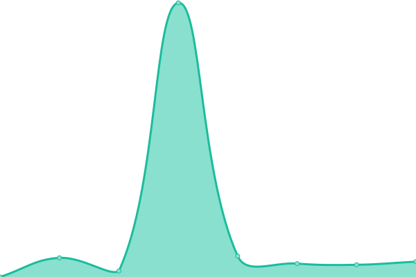
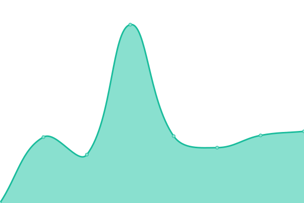
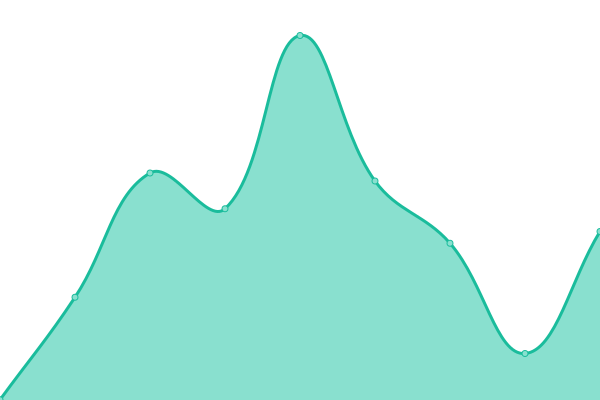
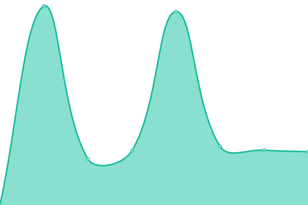

# [📈 Live Status](https://monitoring.mrbmedia.org): <!--live status--> **🟧 Partial outage**

This repository contains the open-source uptime monitor and status page for [Michael Brant](http://michaelbrant.com), powered by [Upptime](https://github.com/upptime/upptime).

With [Upptime](https://upptime.js.org), you can get your own unlimited and free uptime monitor and status page, powered entirely by a GitHub repository. We use [Issues](https://github.com/mrbrant89/mrb-monitoring/issues) as incident reports, [Actions](https://github.com/mrbrant89/mrb-monitoring/actions) as uptime monitors, and [Pages](https://monitoring.mrbmedia.org) for the status page.

<!--start: status pages-->
<!-- This summary is generated by Upptime (https://github.com/upptime/upptime) -->
<!-- Do not edit this manually, your changes will be overwritten -->
<!-- prettier-ignore -->
| URL | Status | History | Response Time | Uptime |
| --- | ------ | ------- | ------------- | ------ |
|  [Sync Social Media [syncsocialmedia.com]](https://syncsocialmedia.com) | 🟩 Up | [sync-social-media-syncsocialmedia-com.yml](https://github.com/mrbrant89/mrb-monitoring/commits/HEAD/history/sync-social-media-syncsocialmedia-com.yml) | 

 1429ms
     
 | 

<a href="https://monitoring.mrbmedia.org/history/sync-social-media-syncsocialmedia-com">100.00%</a>
    

|  [La Jolla Presbyterian Church [ljpres.org]](https://ljpres.org) | 🟩 Up | [la-jolla-presbyterian-church-ljpres-org.yml](https://github.com/mrbrant89/mrb-monitoring/commits/HEAD/history/la-jolla-presbyterian-church-ljpres-org.yml) | 

 416ms
     
 | 

<a href="https://monitoring.mrbmedia.org/history/la-jolla-presbyterian-church-ljpres-org">100.00%</a>
    

|  [Vitality Integrative Wellness [growwithvitality.com]](https://growwithvitality.com) | 🟥 Down | [vitality-integrative-wellness-growwithvitality-com.yml](https://github.com/mrbrant89/mrb-monitoring/commits/HEAD/history/vitality-integrative-wellness-growwithvitality-com.yml) | 

 137ms
     
 | 

<a href="https://monitoring.mrbmedia.org/history/vitality-integrative-wellness-growwithvitality-com">0.00%</a>
    

|  [Hannibal Square [hannibalsquareclt.org]](https://hannibalsquareclt.org) | 🟩 Up | [hannibal-square-hannibalsquareclt-org.yml](https://github.com/mrbrant89/mrb-monitoring/commits/HEAD/history/hannibal-square-hannibalsquareclt-org.yml) | 

 5413ms
     
 | 

<a href="https://monitoring.mrbmedia.org/history/hannibal-square-hannibalsquareclt-org">99.74%</a>
    

|  [Joy Furhman & Associates [joyfuhrman.com]](https://joyfuhrman.com) | 🟩 Up | [joy-furhman-and-associates-joyfuhrman-com.yml](https://github.com/mrbrant89/mrb-monitoring/commits/HEAD/history/joy-furhman-and-associates-joyfuhrman-com.yml) | 

 1144ms
     
 | 

<a href="https://monitoring.mrbmedia.org/history/joy-furhman-and-associates-joyfuhrman-com">100.00%</a>
    

|  [Frontier Financial Planning [frontierfp.biz]](https://www.frontierfp.biz) | 🟩 Up | [frontier-financial-planning-frontierfp-biz.yml](https://github.com/mrbrant89/mrb-monitoring/commits/HEAD/history/frontier-financial-planning-frontierfp-biz.yml) | 

 1493ms
     
 | 

<a href="https://monitoring.mrbmedia.org/history/frontier-financial-planning-frontierfp-biz">100.00%</a>
    

|  [Witchland [witchlandplay.com]](https://witchlandplay.com) | 🟥 Down | [witchland-witchlandplay-com.yml](https://github.com/mrbrant89/mrb-monitoring/commits/HEAD/history/witchland-witchlandplay-com.yml) | 

 116ms
     
 | 

<a href="https://monitoring.mrbmedia.org/history/witchland-witchlandplay-com">0.00%</a>
    

|  [Manage My Entity [managemyentity.com]](https://managemyentity.com) | 🟥 Down | [manage-my-entity-managemyentity-com.yml](https://github.com/mrbrant89/mrb-monitoring/commits/HEAD/history/manage-my-entity-managemyentity-com.yml) | 

 912ms
     
 | 

<a href="https://monitoring.mrbmedia.org/history/manage-my-entity-managemyentity-com">0.00%</a>
    

|  [Prosperity Road [prosperityroad.com]](https://prosperityroad.com) | 🟩 Up | [prosperity-road-prosperityroad-com.yml](https://github.com/mrbrant89/mrb-monitoring/commits/HEAD/history/prosperity-road-prosperityroad-com.yml) | 

 1429ms
     
 | 

<a href="https://monitoring.mrbmedia.org/history/prosperity-road-prosperityroad-com">100.00%</a>
    

|  [A Healthy Divorce [ahealthydivorce.com]](https://ahealthydivorce.com) | 🟩 Up | [a-healthy-divorce-ahealthydivorce-com.yml](https://github.com/mrbrant89/mrb-monitoring/commits/HEAD/history/a-healthy-divorce-ahealthydivorce-com.yml) | 

 2364ms
     
 | 

<a href="https://monitoring.mrbmedia.org/history/a-healthy-divorce-ahealthydivorce-com">100.00%</a>
    

|  [Tailored Legal [tailoredlegal.com]](https://tailoredlegal.com) | 🟩 Up | [tailored-legal-tailoredlegal-com.yml](https://github.com/mrbrant89/mrb-monitoring/commits/HEAD/history/tailored-legal-tailoredlegal-com.yml) | 

 1743ms
     
 | 

<a href="https://monitoring.mrbmedia.org/history/tailored-legal-tailoredlegal-com">100.00%</a>
    

|  [Ben Aguilar, Esq. [benaguilarlaw.com]](https://benaguilarlaw.com) | 🟩 Up | [ben-aguilar-esq-benaguilarlaw-com.yml](https://github.com/mrbrant89/mrb-monitoring/commits/HEAD/history/ben-aguilar-esq-benaguilarlaw-com.yml) | 

 788ms
     
 | 

<a href="https://monitoring.mrbmedia.org/history/ben-aguilar-esq-benaguilarlaw-com">100.00%</a>
    

|  [Fleming & Associates [flemingandassociatesllc.com]](https://flemingandassociatesllc.com) | 🟩 Up | [fleming-and-associates-flemingandassociatesllc-com.yml](https://github.com/mrbrant89/mrb-monitoring/commits/HEAD/history/fleming-and-associates-flemingandassociatesllc-com.yml) | 

 283ms
     
 | 

<a href="https://monitoring.mrbmedia.org/history/fleming-and-associates-flemingandassociatesllc-com">100.00%</a>
    

|  [Kick the Fear out of Your Finances [l.kickthefearoutofyourfinances.com]](https://l.kickthefearoutofyourfinances.com) | 🟥 Down | [kick-the-fear-out-of-your-finances-l-kickthefearoutofyourfinances-com.yml](https://github.com/mrbrant89/mrb-monitoring/commits/HEAD/history/kick-the-fear-out-of-your-finances-l-kickthefearoutofyourfinances-com.yml) | 

 0ms
     
 | 

<a href="https://monitoring.mrbmedia.org/history/kick-the-fear-out-of-your-finances-l-kickthefearoutofyourfinances-com">100.00%</a>
    

|  [CVSR Trivia Night [cvsrtrivianight.org]](https://cvsrtrivianight.org) | 🟥 Down | [cvsr-trivia-night-cvsrtrivianight-org.yml](https://github.com/mrbrant89/mrb-monitoring/commits/HEAD/history/cvsr-trivia-night-cvsrtrivianight-org.yml) | 

 0ms
     
 | 

<a href="https://monitoring.mrbmedia.org/history/cvsr-trivia-night-cvsrtrivianight-org">0.00%</a>
    

|  [Single Oak Realty [singleoakrealty.com]](https://singleoakrealty.com) | 🟩 Up | [single-oak-realty-singleoakrealty-com.yml](https://github.com/mrbrant89/mrb-monitoring/commits/HEAD/history/single-oak-realty-singleoakrealty-com.yml) | 

 1769ms
     
 | 

<a href="https://monitoring.mrbmedia.org/history/single-oak-realty-singleoakrealty-com">100.00%</a>
    

|  [The GreenHouse Group [thegreenhousegroupinc.com]](https://thegreenhousegroupinc.com) | 🟩 Up | [the-green-house-group-thegreenhousegroupinc-com.yml](https://github.com/mrbrant89/mrb-monitoring/commits/HEAD/history/the-green-house-group-thegreenhousegroupinc-com.yml) | 

 1714ms
     
 | 

<a href="https://monitoring.mrbmedia.org/history/the-green-house-group-thegreenhousegroupinc-com">100.00%</a>
    

|  [Robert Ferdowsmakan [torreyhillsoms.com]](https://torreyhillsoms.com) | 🟥 Down | [robert-ferdowsmakan-torreyhillsoms-com.yml](https://github.com/mrbrant89/mrb-monitoring/commits/HEAD/history/robert-ferdowsmakan-torreyhillsoms-com.yml) | 

 319ms
     
 | 

<a href="https://monitoring.mrbmedia.org/history/robert-ferdowsmakan-torreyhillsoms-com">99.98%</a>
    

|  [Cal-State Contractors License Service [licenses4contractors.com]](https://licenses4contractors.com) | 🟩 Up | [cal-state-contractors-license-service-licenses4contractors-com.yml](https://github.com/mrbrant89/mrb-monitoring/commits/HEAD/history/cal-state-contractors-license-service-licenses4contractors-com.yml) | 

 1271ms
     
 | 

<a href="https://monitoring.mrbmedia.org/history/cal-state-contractors-license-service-licenses4contractors-com">100.00%</a>
    

|  [San Diego Whale Watch [sdwhalewatch.com]](https://sdwhalewatch.com) | 🟥 Down | [san-diego-whale-watch-sdwhalewatch-com.yml](https://github.com/mrbrant89/mrb-monitoring/commits/HEAD/history/san-diego-whale-watch-sdwhalewatch-com.yml) | 

 122ms
     
 | 

<a href="https://monitoring.mrbmedia.org/history/san-diego-whale-watch-sdwhalewatch-com">0.00%</a>
    

|  [Peterson Reporting [petersonreporting.com]](https://petersonreporting.com) | 🟩 Up | [peterson-reporting-petersonreporting-com.yml](https://github.com/mrbrant89/mrb-monitoring/commits/HEAD/history/peterson-reporting-petersonreporting-com.yml) | 

 920ms
     
 | 

<a href="https://monitoring.mrbmedia.org/history/peterson-reporting-petersonreporting-com">100.00%</a>
    

|  [Rocky Coast Builders [rockycoastbuilders.com]](https://rockycoastbuilders.com) | 🟩 Up | [rocky-coast-builders-rockycoastbuilders-com.yml](https://github.com/mrbrant89/mrb-monitoring/commits/HEAD/history/rocky-coast-builders-rockycoastbuilders-com.yml) | 

 1507ms
     
 | 

<a href="https://monitoring.mrbmedia.org/history/rocky-coast-builders-rockycoastbuilders-com">100.00%</a>
    

|  [Cruise San Diego [cruise-sd.com]](https://cruise-sd.com) | 🟩 Up | [cruise-san-diego-cruise-sd-com.yml](https://github.com/mrbrant89/mrb-monitoring/commits/HEAD/history/cruise-san-diego-cruise-sd-com.yml) | 

 201ms
     
 | 

<a href="https://monitoring.mrbmedia.org/history/cruise-san-diego-cruise-sd-com">100.00%</a>
    

|  [Simone & Blevins [landlordslegalcenter.com]](https://landlordslegalcenter.com) | 🟩 Up | [simone-and-blevins-landlordslegalcenter-com.yml](https://github.com/mrbrant89/mrb-monitoring/commits/HEAD/history/simone-and-blevins-landlordslegalcenter-com.yml) | 

 338ms
     
 | 

<a href="https://monitoring.mrbmedia.org/history/simone-and-blevins-landlordslegalcenter-com">100.00%</a>
    

|  [Adams Avenue [adamsavenuebusiness.com]](https://adamsavenuebusiness.com) | 🟩 Up | [adams-avenue-adamsavenuebusiness-com.yml](https://github.com/mrbrant89/mrb-monitoring/commits/HEAD/history/adams-avenue-adamsavenuebusiness-com.yml) | 

 1752ms
     
 | 

<a href="https://monitoring.mrbmedia.org/history/adams-avenue-adamsavenuebusiness-com">100.00%</a>
    

|  [Michael Brant [michaelbrant.com]](https://michaelbrant.com) | 🟩 Up | [michael-brant-michaelbrant-com.yml](https://github.com/mrbrant89/mrb-monitoring/commits/HEAD/history/michael-brant-michaelbrant-com.yml) | 

 642ms
     
 | 

<a href="https://monitoring.mrbmedia.org/history/michael-brant-michaelbrant-com">100.00%</a>
    

|  [MRB Development [mrbdev.com]](https://mrbdev.com) | 🟩 Up | [mrb-development-mrbdev-com.yml](https://github.com/mrbrant89/mrb-monitoring/commits/HEAD/history/mrb-development-mrbdev-com.yml) | 

 1802ms
     
 | 

<a href="https://monitoring.mrbmedia.org/history/mrb-development-mrbdev-com">100.00%</a>
    

|  [MRB Hosting [mrbhost.com]](https://mrbhost.com) | 🟩 Up | [mrb-hosting-mrbhost-com.yml](https://github.com/mrbrant89/mrb-monitoring/commits/HEAD/history/mrb-hosting-mrbhost-com.yml) | 

 1057ms
     
 | 

<a href="https://monitoring.mrbmedia.org/history/mrb-hosting-mrbhost-com">100.00%</a>
    

|  [MRB Media Inc [mrbmedia.org]](https://mrbmedia.org) | 🟩 Up | [mrb-media-inc-mrbmedia-org.yml](https://github.com/mrbrant89/mrb-monitoring/commits/HEAD/history/mrb-media-inc-mrbmedia-org.yml) | 

 250ms
     
 | 

<a href="https://monitoring.mrbmedia.org/history/mrb-media-inc-mrbmedia-org">100.00%</a>
    

|  [MR Brant [mrbrant.com]](https://mrbrant.com) | 🟥 Down | [mr-brant-mrbrant-com.yml](https://github.com/mrbrant89/mrb-monitoring/commits/HEAD/history/mr-brant-mrbrant-com.yml) | 

 0ms
     
 | 

<a href="https://monitoring.mrbmedia.org/history/mr-brant-mrbrant-com">0.00%</a>
    

|  [Where The Hell Michael [wherethehellismichael.com]](https://wherethehellismichael.com) | 🟥 Down | [where-the-hell-michael-wherethehellismichael-com.yml](https://github.com/mrbrant89/mrb-monitoring/commits/HEAD/history/where-the-hell-michael-wherethehellismichael-com.yml) | 

 1453ms
     
 | 

<a href="https://monitoring.mrbmedia.org/history/where-the-hell-michael-wherethehellismichael-com">0.00%</a>
    

|  [WHMCS - MRB Media [secure.mrbmedia.org]](https://secure.mrbmedia.org) | 🟩 Up | [whmcs-mrb-media-secure-mrbmedia-org.yml](https://github.com/mrbrant89/mrb-monitoring/commits/HEAD/history/whmcs-mrb-media-secure-mrbmedia-org.yml) | 

 2221ms
     
 | 

<a href="https://monitoring.mrbmedia.org/history/whmcs-mrb-media-secure-mrbmedia-org">100.00%</a>
    

|  [Distinct Construction Solutions [distinctcsolutions.com]](https://distinctcsolutions.com) | 🟩 Up | [distinct-construction-solutions-distinctcsolutions-com.yml](https://github.com/mrbrant89/mrb-monitoring/commits/HEAD/history/distinct-construction-solutions-distinctcsolutions-com.yml) | 

 444ms
     
 | 

<a href="https://monitoring.mrbmedia.org/history/distinct-construction-solutions-distinctcsolutions-com">100.00%</a>
    

|  [Thrive Coaching Academy [tcafitnesscoaching.com]](https://tcafitnesscoaching.com) | 🟩 Up | [thrive-coaching-academy-tcafitnesscoaching-com.yml](https://github.com/mrbrant89/mrb-monitoring/commits/HEAD/history/thrive-coaching-academy-tcafitnesscoaching-com.yml) | 

 1211ms
     
 | 

<a href="https://monitoring.mrbmedia.org/history/thrive-coaching-academy-tcafitnesscoaching-com">100.00%</a>
    

|  [Smarter Wellth [smarterwellth.com]](https://smarterwellth.com) | 🟩 Up | [smarter-wellth-smarterwellth-com.yml](https://github.com/mrbrant89/mrb-monitoring/commits/HEAD/history/smarter-wellth-smarterwellth-com.yml) | 

 1487ms
     
 | 

<a href="https://monitoring.mrbmedia.org/history/smarter-wellth-smarterwellth-com">100.00%</a>
    

|  [Hummert Financial [hummertfinancial.com]](https://hummertfinancial.com) | 🟩 Up | [hummert-financial-hummertfinancial-com.yml](https://github.com/mrbrant89/mrb-monitoring/commits/HEAD/history/hummert-financial-hummertfinancial-com.yml) | 

 1493ms
     
 | 

<a href="https://monitoring.mrbmedia.org/history/hummert-financial-hummertfinancial-com">100.00%</a>
    

|  [Rae of Sunshine [raeofsunshinenaturalcare.com]](https://raeofsunshinenaturalcare.com) | 🟩 Up | [rae-of-sunshine-raeofsunshinenaturalcare-com.yml](https://github.com/mrbrant89/mrb-monitoring/commits/HEAD/history/rae-of-sunshine-raeofsunshinenaturalcare-com.yml) | 

 5012ms
     
 | 

<a href="https://monitoring.mrbmedia.org/history/rae-of-sunshine-raeofsunshinenaturalcare-com">100.00%</a>
    

|  [Sagebrush Saguaro [sagebrushsaguaro.com]](https://sagebrushsaguaro.com) | 🟩 Up | [sagebrush-saguaro-sagebrushsaguaro-com.yml](https://github.com/mrbrant89/mrb-monitoring/commits/HEAD/history/sagebrush-saguaro-sagebrushsaguaro-com.yml) | 

 329ms
     
 | 

<a href="https://monitoring.mrbmedia.org/history/sagebrush-saguaro-sagebrushsaguaro-com">100.00%</a>
    

|  [Katalyst Wellness [katalystwellness.com]](https://katalystwellness.com) | 🟩 Up | [katalyst-wellness-katalystwellness-com.yml](https://github.com/mrbrant89/mrb-monitoring/commits/HEAD/history/katalyst-wellness-katalystwellness-com.yml) | 

 179ms
     
 | 

<a href="https://monitoring.mrbmedia.org/history/katalyst-wellness-katalystwellness-com">100.00%</a>
    

|  [Well Empowered [wellempowered.com]](https://wellempowered.com) | 🟥 Down | [well-empowered-wellempowered-com.yml](https://github.com/mrbrant89/mrb-monitoring/commits/HEAD/history/well-empowered-wellempowered-com.yml) | 

 116ms
     
 | 

<a href="https://monitoring.mrbmedia.org/history/well-empowered-wellempowered-com">0.00%</a>
    

|  [Websites That Elevate [websitesthatelevate.com]](https://websitesthatelevate.com) | 🟩 Up | [websites-that-elevate-websitesthatelevate-com.yml](https://github.com/mrbrant89/mrb-monitoring/commits/HEAD/history/websites-that-elevate-websitesthatelevate-com.yml) | 

 357ms
     
 | 

<a href="https://monitoring.mrbmedia.org/history/websites-that-elevate-websitesthatelevate-com">100.00%</a>
    

|  [Catalina Offshore - Online Fish Market [catalinaop.com]](https://catalinaop.com) | 🟩 Up | [catalina-offshore-online-fish-market-catalinaop-com.yml](https://github.com/mrbrant89/mrb-monitoring/commits/HEAD/history/catalina-offshore-online-fish-market-catalinaop-com.yml) | 

 1113ms
     
 | 

<a href="https://monitoring.mrbmedia.org/history/catalina-offshore-online-fish-market-catalinaop-com">100.00%</a>
    

|  [Compassion Ministries [compassionmexicoministries.org]](https://compassionmexicoministries.org) | 🟩 Up | [compassion-ministries-compassionmexicoministries-org.yml](https://github.com/mrbrant89/mrb-monitoring/commits/HEAD/history/compassion-ministries-compassionmexicoministries-org.yml) | 

 181ms
     
 | 

<a href="https://monitoring.mrbmedia.org/history/compassion-ministries-compassionmexicoministries-org">100.00%</a>
    

|  [New Mercy Outreach [newmercyoutreach.com]](https://newmercyoutreach.com) | 🟥 Down | [new-mercy-outreach-newmercyoutreach-com.yml](https://github.com/mrbrant89/mrb-monitoring/commits/HEAD/history/new-mercy-outreach-newmercyoutreach-com.yml) | 

 114ms
     
 | 

<a href="https://monitoring.mrbmedia.org/history/new-mercy-outreach-newmercyoutreach-com">0.00%</a>
    

|  [Bedrock Retirement Partners [bedrockretirementpartners.com]](https://bedrockretirementpartners.com) | 🟩 Up | [bedrock-retirement-partners-bedrockretirementpartners-com.yml](https://github.com/mrbrant89/mrb-monitoring/commits/HEAD/history/bedrock-retirement-partners-bedrockretirementpartners-com.yml) | 

 223ms
     
 | 

<a href="https://monitoring.mrbmedia.org/history/bedrock-retirement-partners-bedrockretirementpartners-com">100.00%</a>
    

|  [Bay to Bay Financial [baytobayfinancial.com]](https://baytobayfinancial.com) | 🟩 Up | [bay-to-bay-financial-baytobayfinancial-com.yml](https://github.com/mrbrant89/mrb-monitoring/commits/HEAD/history/bay-to-bay-financial-baytobayfinancial-com.yml) | 

 801ms
     
 | 

<a href="https://monitoring.mrbmedia.org/history/bay-to-bay-financial-baytobayfinancial-com">100.00%</a>
    

|  [Small Church Big Table [smallchurchbigtable.com]](https://smallchurchbigtable.com) | 🟥 Down | [small-church-big-table-smallchurchbigtable-com.yml](https://github.com/mrbrant89/mrb-monitoring/commits/HEAD/history/small-church-big-table-smallchurchbigtable-com.yml) | 

 114ms
     
 | 

<a href="https://monitoring.mrbmedia.org/history/small-church-big-table-smallchurchbigtable-com">0.00%</a>
    

|  [Rogers Experimental House [experimentalhouse.com]](https://experimentalhouse.com) | 🟩 Up | [rogers-experimental-house-experimentalhouse-com.yml](https://github.com/mrbrant89/mrb-monitoring/commits/HEAD/history/rogers-experimental-house-experimentalhouse-com.yml) | 

 164ms
     
 | 

<a href="https://monitoring.mrbmedia.org/history/rogers-experimental-house-experimentalhouse-com">48.93%</a>
    

|  [PSERC - Counselors [psercounselors.com]](https://psercounselors.com) | 🟥 Down | [pserc-counselors-psercounselors-com.yml](https://github.com/mrbrant89/mrb-monitoring/commits/HEAD/history/pserc-counselors-psercounselors-com.yml) | 

 0ms
     
 | 

<a href="https://monitoring.mrbmedia.org/history/pserc-counselors-psercounselors-com">0.00%</a>
    

|  [PSERC Counseling [pserchelp.com]](https://pserchelp.com) | 🟥 Down | [pserc-counseling-pserchelp-com.yml](https://github.com/mrbrant89/mrb-monitoring/commits/HEAD/history/pserc-counseling-pserchelp-com.yml) | 

 0ms
     
 | 

<a href="https://monitoring.mrbmedia.org/history/pserc-counseling-pserchelp-com">0.00%</a>
    

|  [Val Daniyar, DMD [valdaniyar.com]](https://valdaniyar.com) | 🟥 Down | [val-daniyar-dmd-valdaniyar-com.yml](https://github.com/mrbrant89/mrb-monitoring/commits/HEAD/history/val-daniyar-dmd-valdaniyar-com.yml) | 

 0ms
     
 | 

<a href="https://monitoring.mrbmedia.org/history/val-daniyar-dmd-valdaniyar-com">0.00%</a>
    

|  [Under the Clouds Spa [spa.valdaniyar.com]](https://spa.valdaniyar.com) | 🟥 Down | [under-the-clouds-spa-spa-valdaniyar-com.yml](https://github.com/mrbrant89/mrb-monitoring/commits/HEAD/history/under-the-clouds-spa-spa-valdaniyar-com.yml) | 

 0ms
     
 | 

<a href="https://monitoring.mrbmedia.org/history/under-the-clouds-spa-spa-valdaniyar-com">0.00%</a>
    

<!--end: status pages-->

[**Visit our status website →**](https://monitoring.mrbmedia.org)

## 📄 License

- Powered by: [Upptime](https://github.com/upptime/upptime)
- Code: [MIT](./LICENSE) © [Michael Brant](http://michaelbrant.com)
- Data in the `./history` directory: [Open Database License](https://opendatacommons.org/licenses/odbl/1-0/)
